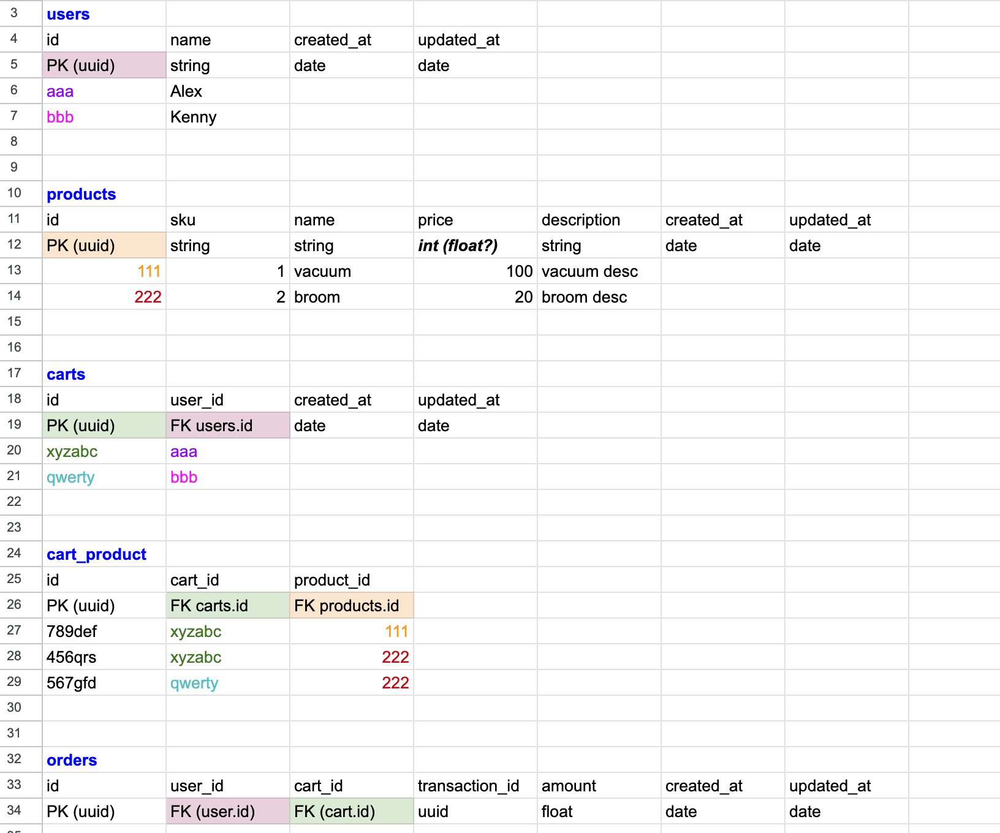
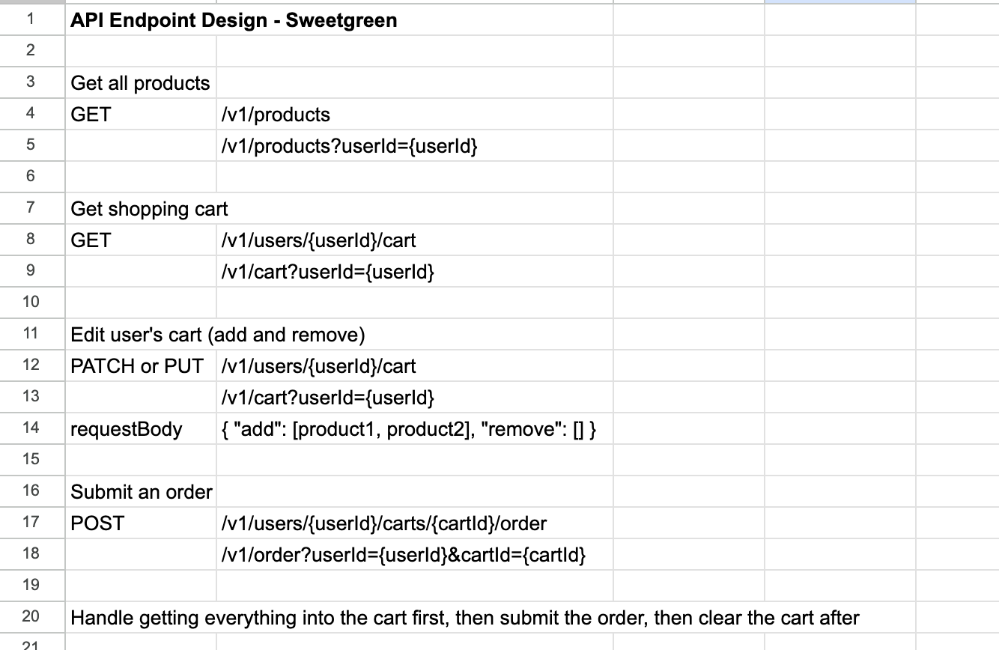

# Ecommerce App

## Getting Started

This course repository requires Node version 20+ and a [TursoDB account](https://turso.tech/)

Install dependencies in the root directory and the client directory, respectively. 

1. In root directory:
```bash
npm install
```
2. Navigate to client directory in a separate terminal:
```bash
cd client
npm install
```
3. Create a [Turso](https://turso.tech/) DB account (free).

Install the Turso CLI:
```bash
# Mac
brew install tursodatabase/tap/turso
# Linux/Windows
curl -sSfL https://get.tur.so/install.sh | bash
```
Signup and Login to Turso (this will open your browser)

Note: The docs tell you to run `turso auth signup` but if you created a Turso account, you can skip this step and run the following command to login. You also won't need to create a replica. 
```
turso auth login
```
Create an ecommerce database:
```bash
turso db create <database-name>
```
4. Create a `.env` file in the root directory and add the following. You can also reference the `.env.example` file in the root. 
```bash
TURSO_CONNECTION_URL=
TURSO_AUTH_TOKEN=
JWT_SECRET=
```
- To get the `TURSO_CONNECTION_URL` and generate a token for your database for `TURSO_AUTH_TOKEN` run the following commands:
```bash
turso db show --url <database-name>
```
```bash
turso db tokens create <database-name>
```
- Generate a secure `JWT_SECRET` using OpenSSL or Node.js
```bash
openssl rand -base64 32
# or
node -e "console.log(require('crypto').randomBytes(32).toString('base64'));"
```
5. In root directory:
```bash
npm run generate
npm run db:push
npm run seed
```
You can explore the data tables by running:
```bash
npm run studio
```

6. In the root directory, start the server:
```bash
npm start
```
Server will run on `http://localhost:3000`.

7. Start React app in the client directory:
```bash
npm run dev
```
You can view the app on `http://localhost:5173`. After creating an account, you'll be able to view the products and shop around. No refunds!


## Overview
This a e-commerce application that allows users to perform the following actions:
- **View a List of Items**: Display items available for purchase.
- **Add Items to Shopping Cart**: Enable users to add items they wish to buy.
- **Checkout Process**: Allow users to "submit" an order.
- **Purchase Confirmation**: Show a confirmation message with the purchase amount and a transaction ID.

## How it Works
1. **User Authentication**
- JWT tokens are used for maintaining user sessions.
- Token is stored in localStorage client-side.
- Flow: User logs in -> JWT token is generated -> Token is stored in localStorage -> Token is sent in the header for routes.

2. **List of Products**
- Flow: User signs in or sings up **->** `AuthProvider` updates state, setting `isAuthenticated` to true -> This triggers `ProductsProvider` to fetch products from backend. 

3. **Cart Management**
- State Management
  - The cart state is managed using useReducer with actions for ADD, REMOVE, QUANTITY, and SUBMIT.
  - The CartContext provides the cart state and dispatch function to child components.

- Adding Items to Cart
  - Flow: User Interaction → dispatch(ADD) → Reducer → State Update → Backend Sync
  - The ADD action handles both new item addition and quantity increment for existing items.

- Removing Items from Cart
  - Flow: User Interaction → dispatch(REMOVE) → Reducer → State Update → Backend Sync
  - The REMOVE action filters out the item from the cart array.

## Approach to Problem Solving

1. Initial Design and Planning

Database Schema Design:

I started by creating a rough design of the data model using Excel since it has an easy to use interface for rows and columns. This helps me map out a visual representation of the data and relationships between tables.

This initial schema design served as a blueprint for the DrizzleORM models, which I tweaked as I built out the application.

2. API Endpoint Planning

I mapped out potential API endpoints early in the process to ensure that the frontend and backend would be in sync. This helped me identify the data I needed to send and receive, as well as the actions that would trigger these requests.


3. Challenges

There were some challenges faced with  cart management. The first implementation made an API request for every cart update and had a different route for every type of cart interaction. This got messy and complicated quickly. I refactored the cart management to a more efficent cart syncing method.

## Future Extensions
- Implement multi-factor authentication
- Integrate social media login options (Google, Facebook, etc.)
- Integrate multiple payment gateways (PayPal, Stripe, etc.)
- Implement personalized product recommendations
- Create a personalized user homepage experience based on user browsing and purhcase history.
- Create a review system for products.
- Implement a "wishlist" feature for users to save items for later.

## Testing Strategy
- React Testing Library: Chosen for its focus on testing components in a way that resembles user interactions.
- Jest: Used as the test runner and for its mocking capabilities.

For testing, I focused on unit tests for key components of the frontend application including:
- Product.test.tsx
- Cart.test.tsx
- ProductList.test.tsx
- Checkout.test.tsx

Areas for Future Testing:
- End-to-End Tests: To validate user flows and interactions.


### Frontend
- React
- React Context API
- React Router
React Hooks:
- useReducer
- useCallback
- useMemo
- useEffect
- useState

### Backend
- Node.js
- Express

Data Storage:
- Turso (Open Source fork of SQLite)
- DrizzleORM (TypeScript ORM)
